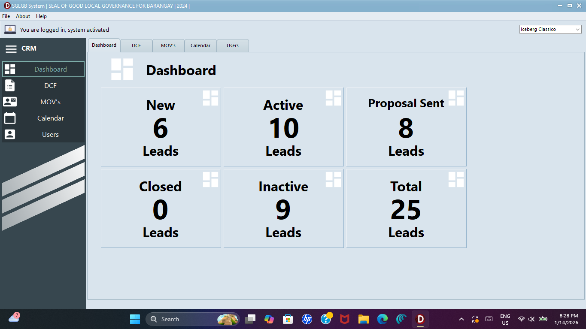
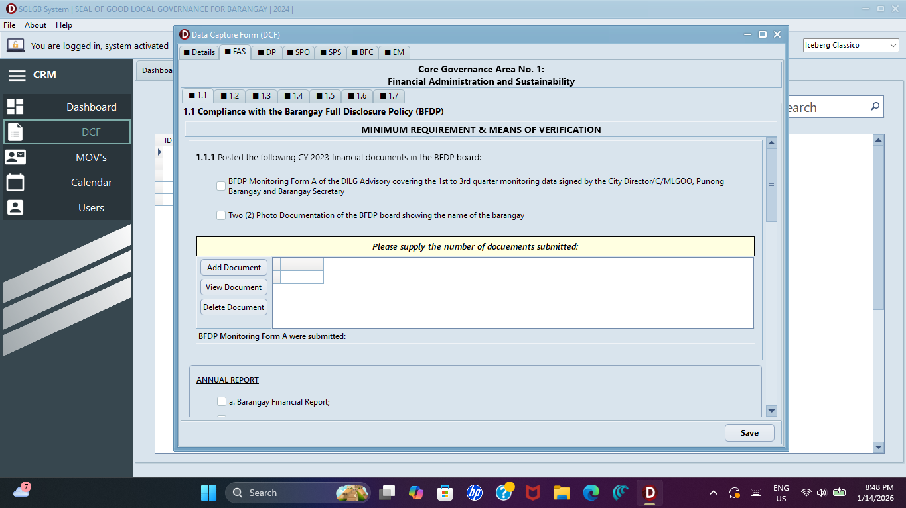
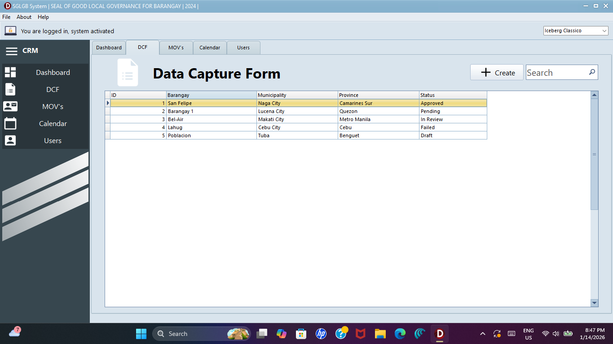

  <h1>🏅 SGLGB Assessment & Monitoring System</h1>
  <h3>Seal of Good Local Governance for Barangay</h3>

  

    A comprehensive desktop application built with <b>Delphi VCL</b> to streamline the data collection,  
    scoring, and reporting process for barangay governance assessments.
  

  

    
    
    
  

  

 

## 📖 Overview

The **SGLGB Assessment System** is a Windows-based application designed to assist Local Government Operations Officers (LGOOs) and Barangay Secretaries in evaluating barangay performance.

Traditionally, SGLGB assessments involve manual checklists and paper-based scoring. This system digitizes the entire workflow, allowing for accurate encoding of governance data across core areas such as **Financial Administration**, **Disaster Preparedness**, and **Peace & Order**. It automatically calculates scores based on DILG memorandums and generates printable assessment reports.

---

## 🎯 Key Features

| Feature | Description |
| :--- | :--- |
| **🏘️ Barangay Profiling** | Database management of barangay demographics, officials, and profile data. |
| **📝 Automated Scoring** | Dynamic forms for checking compliance requirements; automatically computes the overall score based on weighted criteria. |
| **📂 Core Governance Areas** | dedicated modules for the 3 Core Areas (Financial Admin, Disaster Prep, Safety) and Essential Areas. |
| **🖨️ Report Generation** | Generates the official **SGLGB Assessment Form** and Summary of Ratings ready for printing (using FastReport/QuickRep). |
| **🔍 Search & Filtering** | Rapidly filter barangays by district, score range, or compliance status (Pass/Fail). |
| **💾 Data Backup/Restore** | Integrated utilities to secure assessment data and prevent data loss. |

---

## 📸 System Screenshots

<table>
  <tr>
    <td width="50%">
      <h3 align="center">Assessment Form</h3>
      
    </td>
  </tr>
  <tr>
    <td width="50%">
      <h3 align="center">Data Capture List</h3>
      
    </td>
  </tr>
</table>

---

## 🛠️ Technical Details

* **Language:** Object Pascal (Delphi)
* **Framework:** Visual Component Library (VCL)
* **Database:** Microsoft Access / SQLite / MySQL (Update this based on what you used)
* **Components:**
    * `TADOConnection` / `TFDConnection` (Database Connectivity)
    * `TDBGrid` (Data Presentation)
    * `TPageControl` (Tabbed Navigation for Categories)
    * `TFrxReport` (Reporting Engine)

---

## 📥 Installation

1.  **Download:** Get the latest `.zip` file from the releases section.
2.  **Extract:** Unzip the folder to your local drive.
3.  **Database:** Ensure the database file (e.g., `SGLGB.mdb` or `db.sqlite`) is in the same folder as the executable.
4.  **Run:** Open `SGLGB_System.exe`.

> **Note:** This application requires a Windows Environment (Windows 10/11).

---

  
Developed by <b>Lance Esureña</b>

  

    
    
  

